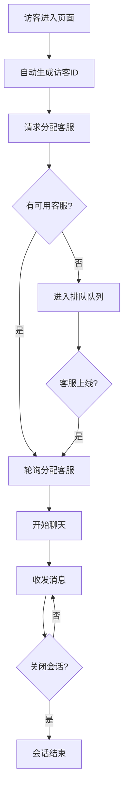

## 1. 产品概述

在线客服系统，支持访客与客服实时聊天，包含访客端和客服端双端功能，实现智能分配、消息存储、历史记录查询等核心能力。

- 主要目的：提供企业与客户之间的实时沟通渠道
- 目标用户：网站访客（无需登录）、企业客服人员（需登录）
- 产品价值：提升客户服务效率，优化沟通体验

## 2. 核心功能

### 2.1 用户角色

| 角色 | 登录方式 | 核心权限 |
|------|----------|----------|
| 访客 | 自动生成访客ID | 发起对话、发送消息、关闭对话、查看历史消息 |
| 客服 | 账号密码登录 | 登录/登出、状态切换、会话列表、收发消息、结束会话、查询历史记录 |

### 2.2 功能模块

1. **访客端**：自动生成访客ID、聊天窗口、消息发送/接收、关闭对话
2. **客服端**：登录页、会话列表、聊天窗口、状态切换、历史查询
3. **分配系统**：轮询分配、排队机制、状态管理
4. **存储系统**：消息持久化、会话管理、用户管理

### 2.3 页面详情

| 页面名称 | 模块名称 | 功能描述 |
|----------|----------|----------|
| 访客聊天页 | 聊天窗口 | 自动生成访客ID、显示消息列表、输入发送、时间戳 |
| 访客聊天页 | 操作栏 | 关闭对话按钮 |
| 客服登录页 | 登录表单 | 用户名密码输入、登录验证 |
| 客服控制台 | 会话列表 | 显示进行中会话、按最近消息排序、未读提醒 |
| 客服控制台 | 聊天窗口 | 消息收发、结束会话按钮 |
| 客服控制台 | 状态栏 | 在线/离线/忙碌状态切换、登出按钮 |
| 客服控制台 | 历史查询 | 按访客ID搜索历史聊天记录 |

## 3. 核心流程

### 3.1 访客聊天流程
访客进入页面 → 自动生成访客ID → 请求分配客服 → 有可用客服则分配 → 开始聊天 → 发送/接收消息 → 访客关闭对话 → 会话结束

### 3.2 客服工作流程
客服登录 → 设置在线状态 → 接收新会话通知 → 选择会话 → 收发消息 → 结束会话 → 登出

### 3.3 分配流程
新对话请求 → 查找在线且非忙碌客服 → 轮询分配 → 无可用客服则进入排队 → 客服上线后自动分配排队中的会话

## 4. 用户界面设计

### 4.1 设计风格
- 主色调：科技蓝 (#1677ff)，辅色：浅灰背景 (#f5f7fa)
- 按钮风格：圆角矩形，悬停有过渡动画
- 字体：PingFang SC / Helvetica Neue，正文 14px，标题 16px
- 布局：左右分栏（左侧会话列表，右侧聊天窗口），卡片式设计
- 图标：简洁线性图标，统一风格

### 4.2 页面设计概览

| 页面名称 | 模块名称 | UI 元素 |
|----------|----------|----------|
| 访客聊天页 | 聊天窗口 | 消息气泡区分访客/客服，时间戳显示，滚动加载 |
| 客服控制台 | 会话列表 | 访客ID、最后消息预览、未读数、时间，悬停高亮 |
| 客服控制台 | 聊天窗口 | 顶部显示访客信息和状态，底部输入框 |
| 客服控制台 | 状态栏 | 状态下拉选择器，平滑过渡效果 |

### 4.3 响应式
- 桌面端：左右分栏布局，最小宽度 1024px
- 移动端：自适应堆叠布局，会话列表可折叠
- 触摸优化：按钮最小 44px，支持滑动手势

### 4.4 动画与交互
- 消息气泡出现动画：从下方滑入 + 渐显
- 新消息提示：轻微缩放动画
- 状态切换：平滑过渡效果
- 输入框聚焦：边框颜色过渡
