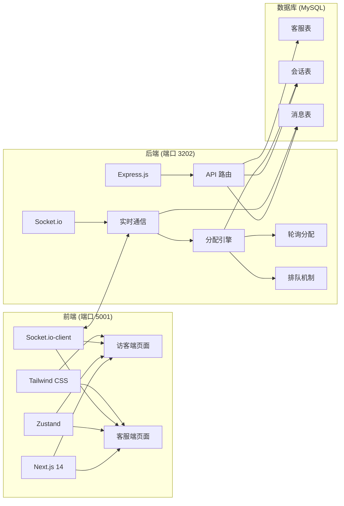
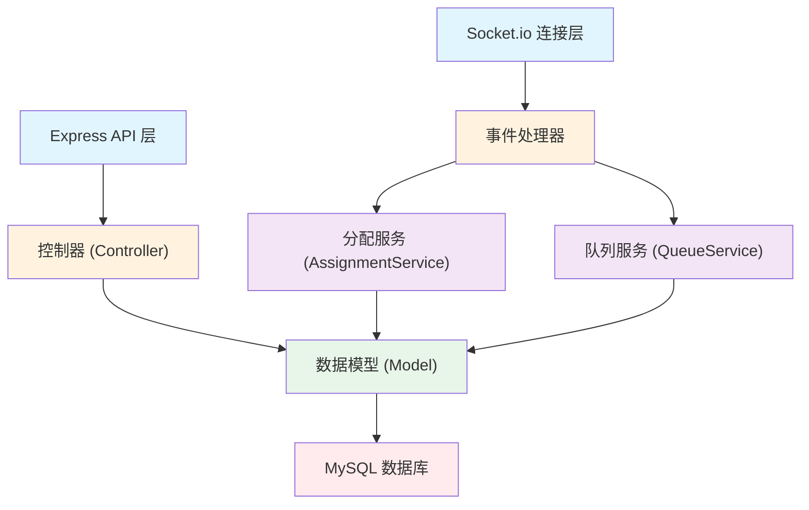
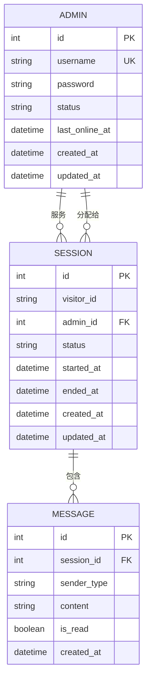

## 1. 架构设计



## 2. 技术选型

| 层级 | 技术栈 | 版本 | 说明 |
|------|--------|------|------|
| 前端框架 | Next.js | 14.x | App Router，SSR 支持 |
| 前端状态管理 | Zustand | 4.x | 轻量级状态管理 |
| 前端样式 | Tailwind CSS | 3.x | 原子化 CSS |
| 实时通信 | Socket.io-client | 4.x | WebSocket 客户端 |
| 后端框架 | Express.js | 4.x | Node.js Web 框架 |
| 后端实时通信 | Socket.io | 4.x | WebSocket 服务端 |
| 数据库 | MySQL | 8.x | 关系型数据库，无密码 |
| 数据库驱动 | mysql2 | 3.x | MySQL 客户端 |
| ORM（可选） | sequelize | 6.x | ORM 框架 |

## 3. 项目结构

```
dzx_233/
├── frontend/                    # Next.js 前端 (端口 5001)
│   ├── src/
│   │   ├── app/
│   │   │   ├── visitor/         # 访客端页面
│   │   │   │   └── page.tsx
│   │   │   ├── admin/           # 客服端页面
│   │   │   │   ├── login/
│   │   │   │   │   └── page.tsx
│   │   │   │   └── dashboard/
│   │   │   │       └── page.tsx
│   │   │   ├── globals.css
│   │   │   └── layout.tsx
│   │   ├── store/               # Zustand 状态管理
│   │   │   ├── useVisitorStore.ts
│   │   │   └── useAdminStore.ts
│   │   ├── components/
│   │   │   ├── visitor/
│   │   │   │   ├── ChatWindow.tsx
│   │   │   │   ├── MessageBubble.tsx
│   │   │   │   └── MessageInput.tsx
│   │   │   └── admin/
│   │   │       ├── SessionList.tsx
│   │   │       ├── ChatPanel.tsx
│   │   │       ├── StatusBar.tsx
│   │   │       └── HistorySearch.tsx
│   │   ├── hooks/
│   │   │   └── useSocket.ts
│   │   └── types/
│   │       └── index.ts
│   ├── next.config.js
│   ├── tailwind.config.ts
│   └── package.json
│
└── backend/                     # Express 后端 (端口 3202)
    ├── src/
    │   ├── app.ts
    │   ├── server.ts
    │   ├── config/
    │   │   ├── database.ts
    │   │   └── socket.ts
    │   ├── models/
    │   │   ├── Admin.ts
    │   │   ├── Session.ts
    │   │   └── Message.ts
    │   ├── controllers/
    │   │   ├── authController.ts
    │   │   ├── sessionController.ts
    │   │   └── messageController.ts
    │   ├── services/
    │   │   ├── assignmentService.ts
    │   │   └── queueService.ts
    │   ├── routes/
    │   │   ├── authRoutes.ts
    │   │   ├── sessionRoutes.ts
    │   │   └── messageRoutes.ts
    │   ├── middleware/
    │   │   └── auth.ts
    │   └── types/
    │       └── index.ts
    └── package.json
```

## 4. 路由定义

### 前端路由

| 路由 | 页面 | 说明 |
|------|------|------|
| `/` | 访客聊天页 | 访客入口，自动生成访客ID |
| `/visitor` | 访客聊天页 | 访客聊天界面 |
| `/admin/login` | 客服登录页 | 账号密码登录 |
| `/admin/dashboard` | 客服控制台 | 会话列表、聊天窗口、历史查询 |

### 后端 API 路由

| 方法 | 路由 | 说明 |
|------|------|------|
| POST | `/api/auth/login` | 客服登录 |
| POST | `/api/auth/logout` | 客服登出 |
| PUT | `/api/admin/status` | 更新客服状态 |
| GET | `/api/sessions` | 获取会话列表 |
| GET | `/api/sessions/:id` | 获取会话详情 |
| PUT | `/api/sessions/:id/end` | 结束会话 |
| GET | `/api/sessions/visitor/:visitorId` | 按访客ID查询历史会话 |
| GET | `/api/messages/:sessionId` | 获取会话消息列表 |
| GET | `/api/visitor/:visitorId/history` | 获取访客历史消息 |

## 5. Socket.io 事件定义

### 客户端 → 服务端

| 事件名 | 参数 | 说明 |
|--------|------|------|
| `visitor:connect` | `{ visitorId }` | 访客连接 |
| `visitor:message` | `{ sessionId, content }` | 访客发送消息 |
| `visitor:close` | `{ sessionId }` | 访客关闭会话 |
| `admin:login` | `{ adminId }` | 客服登录上线 |
| `admin:logout` | `{ adminId }` | 客服登出下线 |
| `admin:status` | `{ adminId, status }` | 客服状态变更 |
| `admin:message` | `{ sessionId, content }` | 客服发送消息 |
| `admin:join` | `{ sessionId }` | 客服加入会话 |
| `admin:end` | `{ sessionId }` | 客服结束会话 |
| `typing` | `{ sessionId, sender }` | 正在输入 |

### 服务端 → 客户端

| 事件名 | 参数 | 说明 |
|--------|------|------|
| `session:assigned` | `{ session, admin }` | 会话分配成功 |
| `session:queued` | `{ position }` | 进入排队队列 |
| `session:new` | `{ session }` | 新会话通知（给客服） |
| `message:new` | `{ message }` | 新消息通知 |
| `message:read` | `{ messageId }` | 消息已读 |
| `session:ended` | `{ sessionId }` | 会话结束通知 |
| `admin:online` | `{ adminId }` | 客服上线通知 |
| `typing` | `{ sessionId, sender }` | 对方正在输入 |
| `error` | `{ message }` | 错误通知 |

## 6. 服务端架构图



## 7. 数据模型

### 7.1 ER 图



### 7.2 DDL 语句

```sql
-- 客服表
CREATE TABLE IF NOT EXISTS admins (
    id INT AUTO_INCREMENT PRIMARY KEY,
    username VARCHAR(50) NOT NULL UNIQUE,
    password VARCHAR(255) NOT NULL,
    status ENUM('online', 'offline', 'busy') DEFAULT 'offline',
    last_online_at DATETIME NULL,
    created_at DATETIME DEFAULT CURRENT_TIMESTAMP,
    updated_at DATETIME DEFAULT CURRENT_TIMESTAMP ON UPDATE CURRENT_TIMESTAMP,
    INDEX idx_status (status)
) ENGINE=InnoDB DEFAULT CHARSET=utf8mb4;

-- 会话表
CREATE TABLE IF NOT EXISTS sessions (
    id INT AUTO_INCREMENT PRIMARY KEY,
    visitor_id VARCHAR(100) NOT NULL,
    admin_id INT NULL,
    status ENUM('waiting', 'active', 'ended') DEFAULT 'waiting',
    started_at DATETIME NULL,
    ended_at DATETIME NULL,
    created_at DATETIME DEFAULT CURRENT_TIMESTAMP,
    updated_at DATETIME DEFAULT CURRENT_TIMESTAMP ON UPDATE CURRENT_TIMESTAMP,
    INDEX idx_visitor_id (visitor_id),
    INDEX idx_admin_id (admin_id),
    INDEX idx_status (status),
    FOREIGN KEY (admin_id) REFERENCES admins(id) ON DELETE SET NULL
) ENGINE=InnoDB DEFAULT CHARSET=utf8mb4;

-- 消息表
CREATE TABLE IF NOT EXISTS messages (
    id INT AUTO_INCREMENT PRIMARY KEY,
    session_id INT NOT NULL,
    sender_type ENUM('visitor', 'admin') NOT NULL,
    content TEXT NOT NULL,
    is_read TINYINT(1) DEFAULT 0,
    created_at DATETIME DEFAULT CURRENT_TIMESTAMP,
    INDEX idx_session_id (session_id),
    INDEX idx_is_read (is_read),
    FOREIGN KEY (session_id) REFERENCES sessions(id) ON DELETE CASCADE
) ENGINE=InnoDB DEFAULT CHARSET=utf8mb4;

-- 初始化客服账号 (admin/123456)
INSERT INTO admins (username, password) VALUES 
('admin', '$2b$10$N9qo8uLOickgx2ZMRZoMyeIjZAgcfl7p92ldGxad68LJZdL17lhWy')
ON DUPLICATE KEY UPDATE username=username;
```

### 7.3 数据类型定义

```typescript
// 客服状态
type AdminStatus = 'online' | 'offline' | 'busy';

// 会话状态
type SessionStatus = 'waiting' | 'active' | 'ended';

// 发送者类型
type SenderType = 'visitor' | 'admin';

// 客服
interface Admin {
  id: number;
  username: string;
  status: AdminStatus;
  lastOnlineAt: Date | null;
  createdAt: Date;
  updatedAt: Date;
}

// 会话
interface Session {
  id: number;
  visitorId: string;
  adminId: number | null;
  status: SessionStatus;
  startedAt: Date | null;
  endedAt: Date | null;
  createdAt: Date;
  updatedAt: Date;
  lastMessage?: Message;
  unreadCount?: number;
}

// 消息
interface Message {
  id: number;
  sessionId: number;
  senderType: SenderType;
  content: string;
  isRead: boolean;
  createdAt: Date;
}
```

## 8. 核心逻辑说明

### 8.1 轮询分配算法
- 维护在线且非忙碌的客服列表
- 使用计数器记录上次分配的客服索引
- 新会话分配时，从上次索引的下一位开始分配
- 每次分配后更新计数器，实现轮询效果

### 8.2 排队机制
- 无可用客服时，会话进入排队队列（内存队列 + 数据库标记 waiting）
- 客服状态变更为在线时，按顺序从队列头部取出会话分配
- 访客端实时显示排队位置

### 8.3 历史消息加载
- 访客重新访问时，根据 localStorage 存储的 visitorId 查询最近会话
- 加载该会话的所有历史消息
- 如没有进行中的会话，则创建新会话
